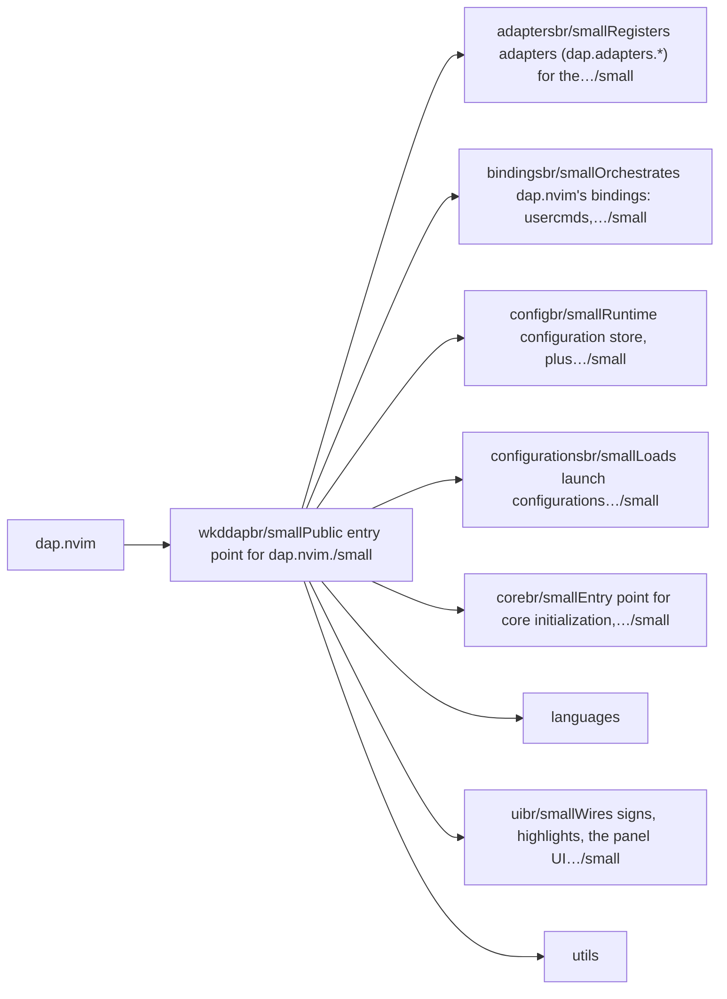
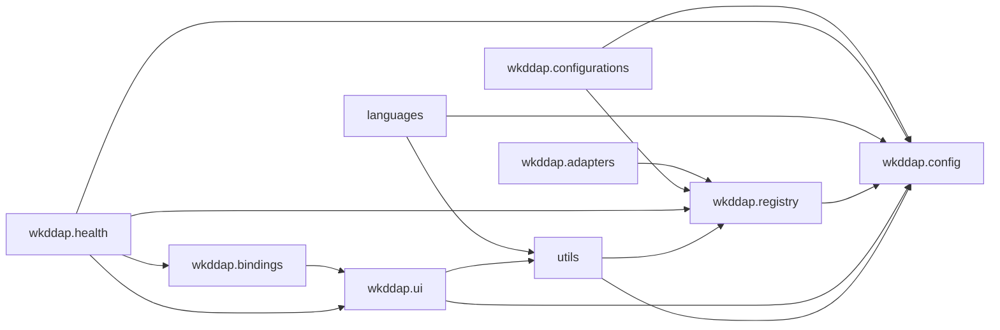

# dap.nvim — module map

> **Generated** by `documentation`. Do not edit by hand — run `:DocMap`
> (or `nvim --headless -l scripts/gen_map.lua`) to regenerate.

**11 modules** · 3 namespaces · 25 helper files

The [interactive map](index.html) has filtering, full descriptions and
source links; this page is the version the code host renders directly.

## Namespaces

## Dependencies

Which parts of the tree require which, rolled up to the second level.
The [interactive map](index.html)'s **Deps** view has this per module,
in both directions, with load-time and lazy requires told apart.

## Modules

| Module | Description | Fns | Docs |
|---|---|---|---|
| `wkddap` | Public entry point for dap.nvim. | 5 | [src](../../lua/wkddap/init.lua) |
| &nbsp;&nbsp;`wkddap.adapters` | Registers adapters (dap.adapters.*) for the requested languages via registry.register(), which requires each language's `wkddap.languages.<lang>` module and… | 1 | [src](../../lua/wkddap/adapters/init.lua) |
| &nbsp;&nbsp;`wkddap.bindings` | Orchestrates dap.nvim's bindings: usercmds, keymaps, which-key, autocmds. | 1 | [src](../../lua/wkddap/bindings/init.lua) |
| &nbsp;&nbsp;&nbsp;&nbsp;`wkddap.bindings.autocmds` | Cursorline toggle while the nvim-dap-ui window is open. | 1 | [src](../../lua/wkddap/bindings/autocmds/init.lua) |
| &nbsp;&nbsp;&nbsp;&nbsp;`wkddap.bindings.keymaps` | Default normal/visual-mode keymaps on top of nvim-dap and the panel UI. | 1 | [src](../../lua/wkddap/bindings/keymaps/init.lua) |
| &nbsp;&nbsp;&nbsp;&nbsp;`wkddap.bindings.usercmds` | Registers :Dap <subcommand>, one verb built via lib.nvim's composer (:Verb sub … + <Tab> completion + Markdown docgen). | 1 | [src](../../lua/wkddap/bindings/usercmds/init.lua) |
| &nbsp;&nbsp;&nbsp;&nbsp;`wkddap.bindings.which_key` | Optional, guarded which-key group label for the DAP keymap prefix. | 2 | [src](../../lua/wkddap/bindings/which_key/init.lua) |
| &nbsp;&nbsp;`wkddap.config` | Runtime configuration store, plus adapter/binary metadata for dap.nvim. | 4 | [src](../../lua/wkddap/config/init.lua) |
| &nbsp;&nbsp;`wkddap.configurations` | Loads launch configurations (dap.configurations.*) for the requested languages, by requiring each language's `wkddap.languages.<lang>` module and calling its… | 1 | [src](../../lua/wkddap/configurations/init.lua) |
| &nbsp;&nbsp;`wkddap.core` | Entry point for core initialization, delegating to core/setup.lua. | 1 | [src](../../lua/wkddap/core/init.lua) |
| &nbsp;&nbsp;`languages` |  |  |  |
| &nbsp;&nbsp;`wkddap.ui` | Wires signs, highlights, the panel UI provider, and nvim-dap-virtual-text. | 1 | [src](../../lua/wkddap/ui/init.lua) |
| &nbsp;&nbsp;`utils` |  |  |  |

## Drift

0 errors · 0 warnings · 24 info

No errors or warnings.

24 informational findings

| Check | Message |
|---|---|
| `missing-readme` | lua/wkddap has no README.md |
| `missing-readme` | lua/wkddap/adapters has no README.md |
| `missing-readme` | lua/wkddap/bindings has no README.md |
| `missing-readme` | lua/wkddap/bindings/autocmds has no README.md |
| `missing-readme` | lua/wkddap/bindings/keymaps has no README.md |
| `missing-readme` | lua/wkddap/bindings/usercmds has no README.md |
| `missing-readme` | lua/wkddap/bindings/which_key has no README.md |
| `missing-readme` | lua/wkddap/config has no README.md |
| `missing-readme` | lua/wkddap/configurations has no README.md |
| `missing-readme` | lua/wkddap/core has no README.md |
| `missing-readme` | lua/wkddap/ui has no README.md |
| `unreferenced-module` | wkddap is required by no other file in the tree |
| `unreferenced-module` | wkddap.health is required by no other file in the tree |
| `unreferenced-module` | wkddap.languages.assembly is required by no other file in the tree |
| `unreferenced-module` | wkddap.languages.c is required by no other file in the tree |
| `unreferenced-module` | wkddap.languages.go is required by no other file in the tree |
| `unreferenced-module` | wkddap.languages.javascript is required by no other file in the tree |
| `unreferenced-module` | wkddap.languages.lua is required by no other file in the tree |
| `unreferenced-module` | wkddap.languages.python is required by no other file in the tree |
| `unreferenced-module` | wkddap.languages.rust is required by no other file in the tree |
| `unreferenced-module` | wkddap.languages.zig is required by no other file in the tree |
| `unreferenced-module` | wkddap.ui.dapui is required by no other file in the tree |
| `unreferenced-module` | wkddap.ui.dapview is required by no other file in the tree |
| `unreferenced-module` | wkddap.utils.executable is required by no other file in the tree |

